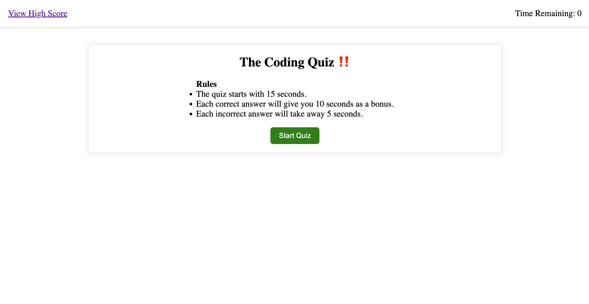
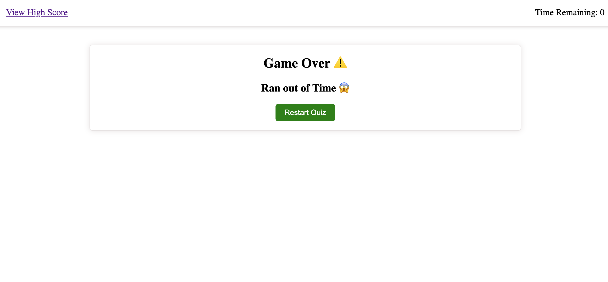
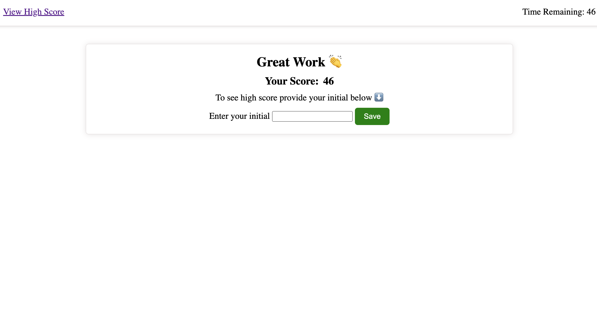
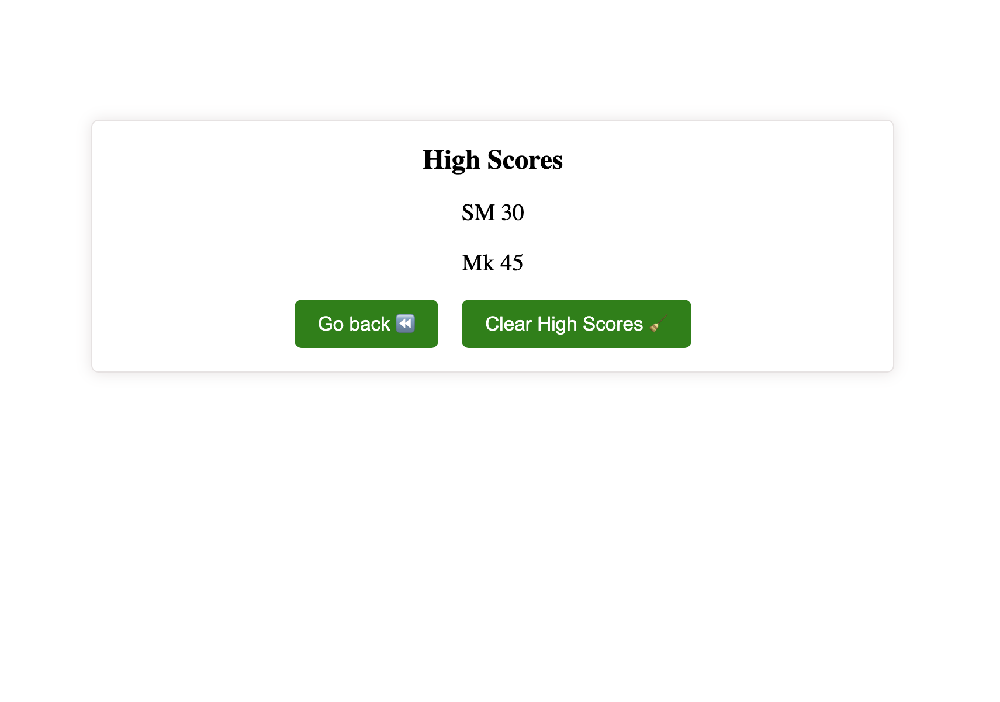

# code-quiz-challenge-4
**[Code Quiz](https://salidamaharjan.github.io/code-quiz-challenge-4/)**

**[My GitHub Page Link](https://github.com/salidamaharjan/code-quiz-challenge-4)**

## Description
* This project builds multiple choices question timed quiz and stores the scores.
* It has two pages, one display the quiz questions and other displays high scores.
* Web APIs are used to complete this project along with the help of HTML, CSS and JavaScript.
* Web API methods like `document.querySelector()`, `setAttribute()`, `getAttribute()`, `add.EventListener()`, `createElement()`, `appendChild()`, `setInterval()`, `setTimeout()`, `clearInterval()`, `getItem()`, `setItem()` are used in this project.

## Installation
No specific installation required, you can simply click on the Code Quiz link provided on the top of the page.

## Usage
When loaded the page looks like follow:

* When clicked on the start quiz button it will prompt to the quiz section.
* The timer starts and another question loads after you clicked the answer.
* Each correct answer will give you 10 bonus seconds and each incorrect answer will deduct 5 seconds.
* Remember if the timer reaches zero the quiz is over but you can restart the quiz by clicking on to the restart quiz button.

* When you answer all the question, the time remained will be your score and you will enter your initials to store the score.

* The high score page is displayed after you enter the initials.

* You can also view the high scores when you click on the view high scores link.
* You can clear the high scores or go back to start the quiz again.

## Credits
Coding Boot Camp Instructors, [MDN References](https://developer.mozilla.org/en-US/), class discussions and practices.

## License
N/A